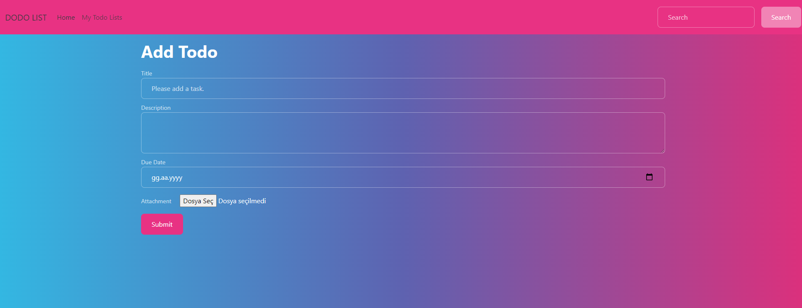
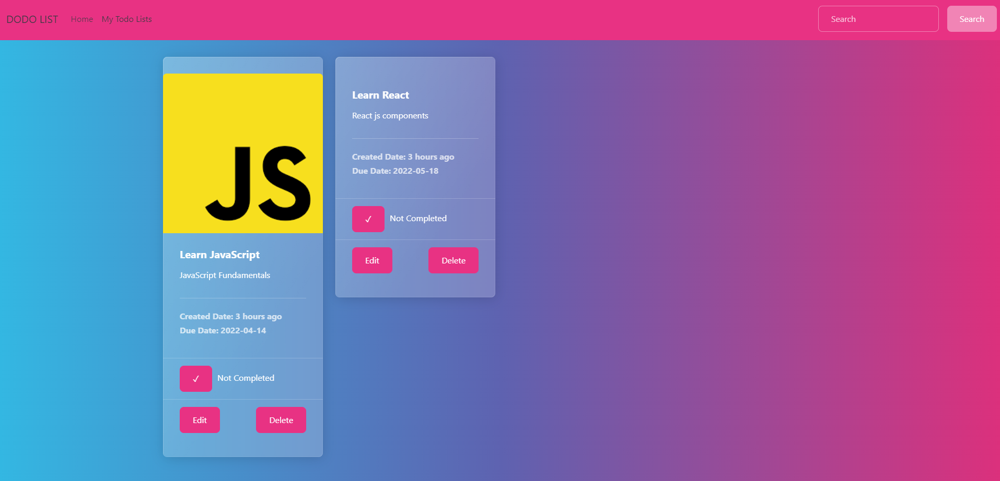
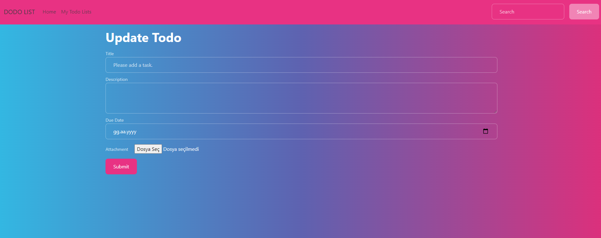

<h1>MERN Stack CRUD App --- Todo List</h1>

<h2> Uygulama çalışma aşamaları </h2>
 

 Uygulama 4 temel işlem üzerine kurulmuştur. 'CRUD' olarak adlandırılan, Create - Read - Update - Delete işlemleridir. Bunlar oluşturma, okuma, güncelleme ve silme, veri depolama olarak Türkçeye çevrilebilir.

CRUD u uygulamamız üzerinden örnekleyecek olursak, Add Todo başlıgı altındaki Form submit edildiğinde database imize post isteği gerçekleşir ve MongoDb içerisnde oluşturduğumuz Collections da yeni bir JSON objesi yaratır. Bu bir create olarak adlandırılır.

Kalan işlemler de put, delete ve get işlemleridir.

**Dökümanın Backend ve Frontend kısımlarında uygulamanın detaylı açıklamaları yazılmıştır.

<h2> 1- Backend </h2>

----<strong> [Backend](./backend/README.md) </strong>

<h2> 2- Frontend </h2>

----<strong> [Frontend](./frontend/README.md) </strong>

<h2> Uygulama Ekran Görünteleri </h2>

Home Page

My Todo List Page

Update Page

