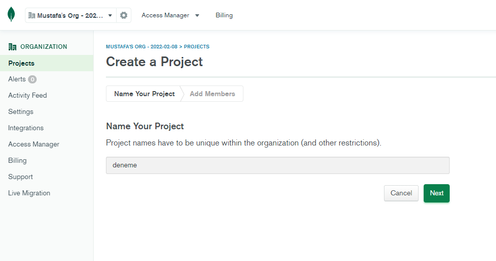
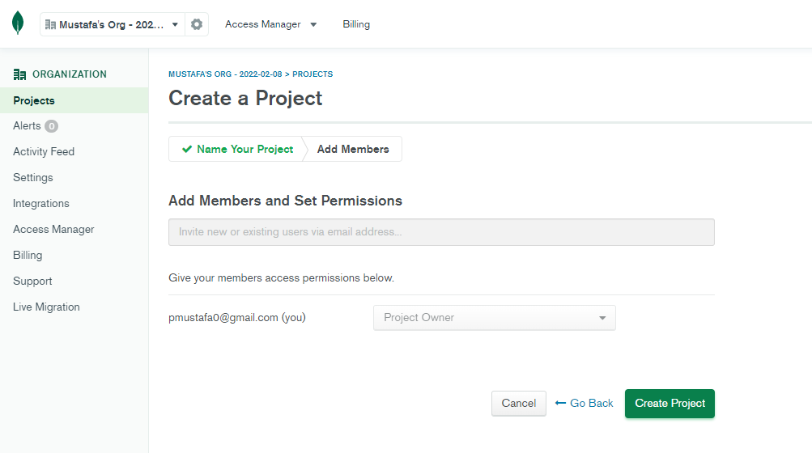
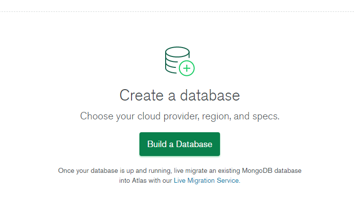
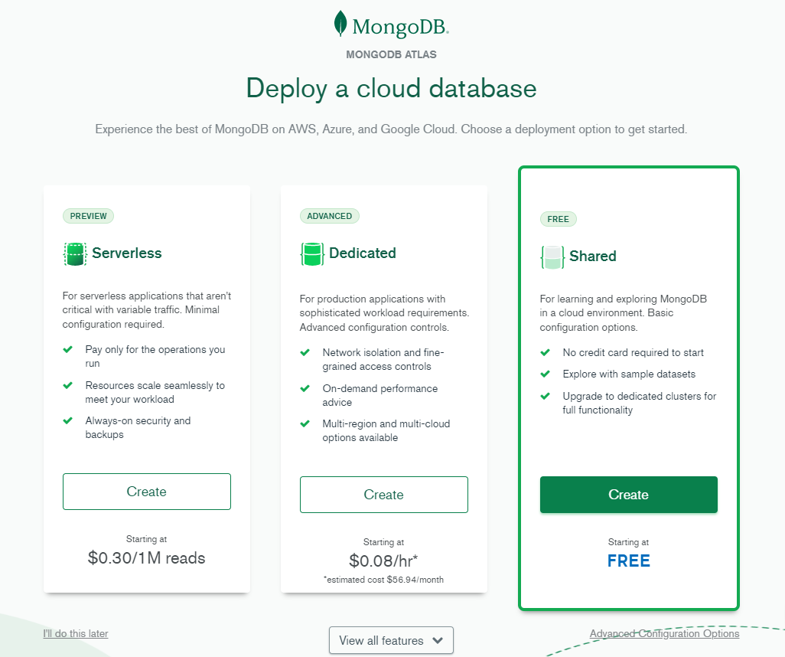
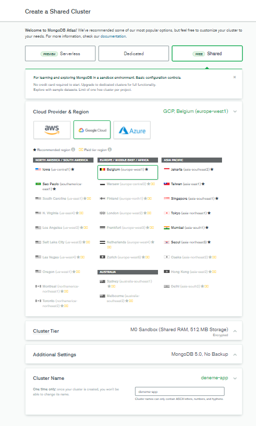
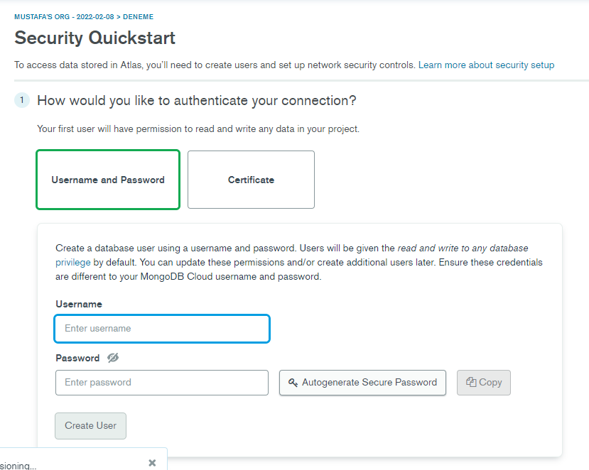
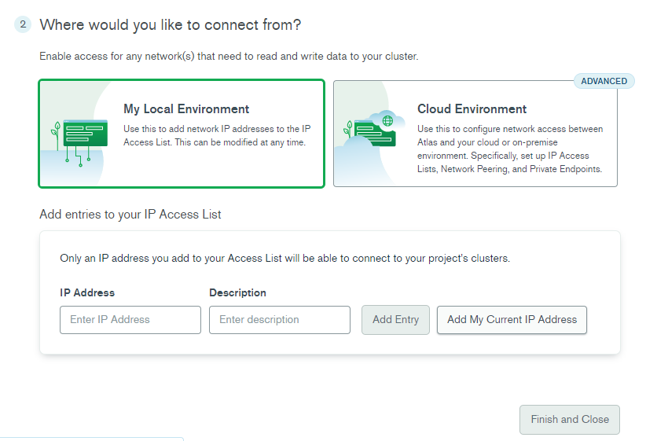
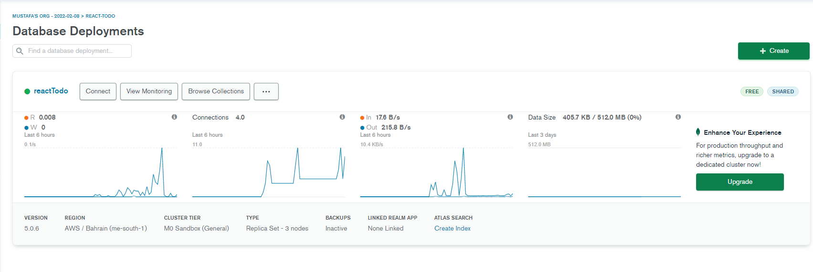
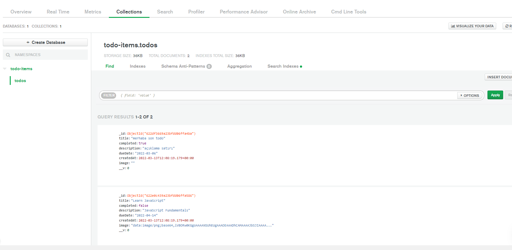

<h1>Backend </h1>
<hr/>
<br/>
<p>Backend de kurulan paketler;</p>
<li>Express js</li>
<li>Mongoose</li>
<li>dotenv</li>
<li>cors</li>
<br/>
<hr/>
<p>Sunucu tarafında ilk olarak Mongo DB Atlas kullanarak bir database olusturduk.</p>

<p>
    Mongoose ile database oluşturmak için aşağıdaki adımları kullanabilirsiniz.

    1. MongoDB üzerinde bir hesaba ihtiyacınız olacaktır.
    2. Giriş yaptıktan sonra yeni bir proje oluşturmak için resimdeki adımı izleyebilirsin.
    3. Proje adını giirp Next dedikten sonra,Projeye kimlerin erişebileceğini tanımlayabilirsin.
    4. Şimdi sıra database oluşturmakta bu kısımda Build a Database dedikten sonra, Deploy a Cloud Databese kısmında free seçeneğiyle devam edebilirsin.
    5. Sunucunun bulunacagı lokasyonu seçip cluster ismini verdikten sonra diğer adıma geçebilirsin.
    6. Security Quickstart kısmında ise database ine erişecek olan kişilerin kullanıcı adı ve şifresini belirleyebildiğin ekrana geleceksin,  2.seçenekte ise nereden bağlanacagın ile ilgili bir soru gelecek eğer bir buluta bağlanmayıp kendi localhostun üzereinden bağlanacaksan My Local Environment seçeneği ile devam edebilirisin ve portunda çalışmaya başlarsın.
    7. Database Deployments kısmı ise bağlantıları, boyutu ve server ile ilgili genel bilgileri gösteren bir ekrandır.
    8. Overwiev penceresine giriş yaptıktan sonra collectionsları ve json objelerini görebiliriz. Burada birden fazla collections oluşturabilir ve bağlanabilriz.
    9. Mongo DB bize çok fazla esneklik saglayan bir NoSql veri tabanıdır. Klasik satır ve sütunların yerine bize Shema lar tanımlayıp farklı küme koleksiyon ve json objeleri veren bir veri tabanıdır.

</p>

<br/>



<br/>



<br/>



<br/>



<br/>



<br/>



<br/>



<br/>



<br/>



<br/>

<p> Sırada Mongodb ile iletişim kurmamızı sağlayan paket olan mongoose paketini kurmak var. </p>
<br/>

Link: [mongoose](https://github.com/Automattic/mongoose)
<br/>

<p>mongoose ile Schema oluşturuyoruz. Bu kısımda bizim JSON objemizde olması gereken kısımları tanımlıyoruz. Zorunlu olarak bizim veri tabınımızda bulunmasını istediğimiz kısımları required yazarak tanımladık. Ve bu tanımladıgımız todoSchema yı todos adında modele tanımladık.</p>
<br/>

```
import mongoose from "mongoose";

const todoSchema = new mongoose.Schema({
    title: {
        type: String,
        required: true
    },
    completed: {
        type: Boolean,
        default: false
    },
    description: {
        type: String,
        required: true
    },
    dueDate: {
        type: String,
    },
    createdAt: {
        type: Date,
        default: Date.now()
    },
    image: {
        type: String
    }
});


const Todo = mongoose.model("todos", todoSchema);


export default Todo;

```

<p>Yukarıda olusturdugumuz Schema bizim mongdoDB ile olan bağlantımızın temelini olsuturuyor. Yani buraya yapacagımız istekler aslında dogrudan database imize giden bir kısım. Tabi bu istekleri dogrudan yapmıyoruz ve her isteğe karşılık gelen bir url miz var yani route diyoruz. Bu route lar bizim frontend kısmında yapacagımız işlemlere karşılık gelceği için düzgün tasarlanmalıdır. Örneğin anasayfaya yapılacak get işlemlerine karşılık gelen, yani gelen ve giden istekleri belirtmek için / ile anasayfa route u tanımlayabiliriz. Kod üzerinden gösterecek olursak;</p>
<br/>

```

router.get('/', async (req, res) => {

try {
    const todos = await memoryTodo.find()
    res.status(200).send(todos)
} catch (error) {
    res.status(404).send({ message: error.message })

    }
});

```

<p>Yukarıdaki kodda Anasayfaya yapılacak get isteklerine karşılık olarak döndüreceği işlemleri tanımladık.
Burada try catch kullanarak hata durumunda hata mesajını gönderdik. Ve bu hata mesajını frontend kısmında göstereceğiz.
try içerisine memoryTodo.find() ile todos tablosunu bulup döndürdük. Ve bu todos tablosunu frontend kısmında göstereceğiz.
find() bize memortTodo tablosundaki tüm verileri döndürür.
buradaki parametreler response ve request dir. response yanıt ve request istek anlamına gelir. 
</p>

<p> Bu kod sadece express server de tnaımladıgımız route larımız. yani daha frontend den istek yapılmadı.
Eğer frontend den bir istek yapılsaydı bu ilk olarak axios paketi ile get isteiğinde bulunurdu. bu istek backend de express js yardımıyla get isteğini kontrol eder route e istek doğruysa yönlendirmeyi yapar. Yani bu yukarıdaki kod sadece yönlendirmeyi saglayan bir kod blogudur.  
</p>

```

export const getTodos = async () => API.get('/todos');

```

<p> Yukarıdaki kod blogu fronend de bulunan bir axios işlemine aittir. Yalnız Burada dikkat çeken iki konu var birincisi API kodu nereden çıktı? ikincisi ise istek /todos a yapılıyor. API tamamen kodu daha okunabilir ve az satırla yazmamız için yaılan bir kısalmadan ibarettir.  </p>

```
const API = axios.create({baseURL: 'http://localhost:5000'});
```

<p>Bu API kelimesinin aslında sadece url tanımlaması oldugunu bize göseriyor. Peki biz get isteklerini / yönlendirmesiyle yapmıstık ama burada /todos var. Bunu biz backendimizin anasayfasında yani index.js de tanımladık, böylece / a yapılan istekler ve /todos a yapılan istekler karsılanacaktır. </p>

```
app.use('/todos', todoRouters);
```

<p> Bu kod bize /todos da todoRouters ı kullan anlamına geliyor.</p>
<br/>

<p>Express js</p>

<br/>

Link: [express](https://expressjs.com/)

<br/>
<p>HTTP isteklerine yanıt vermek için orta yolların ayarlanmasına izin verir.

HTTP Yöntemi ve URL'ye göre farklı eylemler gerçekleştirmek için kullanılan bir yönlendirme tablosu tanımlar.

</p>

```
const app = express()

app.use(express.json())
```
express uygulamamızı app değişkenine atadık. Bu değişkeni kullanarak express serverımızı oluşturduk.

app.use(express.json()) ile express serverımızın json formatına uygun bir yönlendirme tablosu oluşturduk. ve daha sonra;

```
app.listen(process.env.PORT, () => {    
    mongoose.connect(process.env.MONGO_URI, { useNewUrlParser: true, useUnifiedTopology: true }, () => {
        console.log('MongoDB connected...');
    });
});
```
Az önce bahsettiğimiz mongoDb ile express js bağlantısını kuruyoruz. Bu kod bize 5000 portu dinleyip, mongoose paketi ile mongodb ye bağlanmasını söylüyor.

MONGO_URI değişkeni mongodb bağlantısının yapılacağı url bilgisini tutar. bu api key bağlantısını gizli tutmak için dotenv paketi ile gizli tuttuk. Gitignore dosyasına ekledik.

PORT değişkenini 5000 portu olarak tanımladık. Bu işlemide dotenv dosyası içerinde tanımladık.

Böylece localhost:5000 üzerinde serverımız çalışıyor. Ve localhost:5000 üzerinde /todos yada /todos/:id üzerine gelen get post put delete istekleri Router ile karşılıyoruz.Axios bize doğrudan backend ile bağlantı kurmak için kullanılır.
